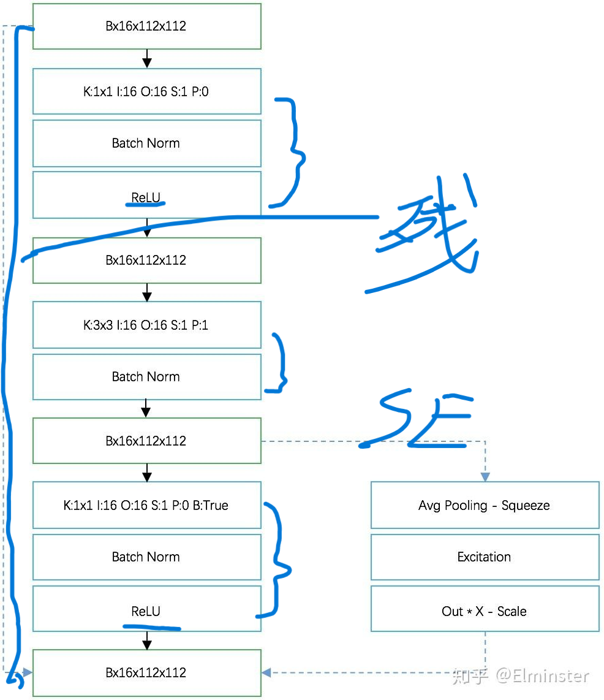
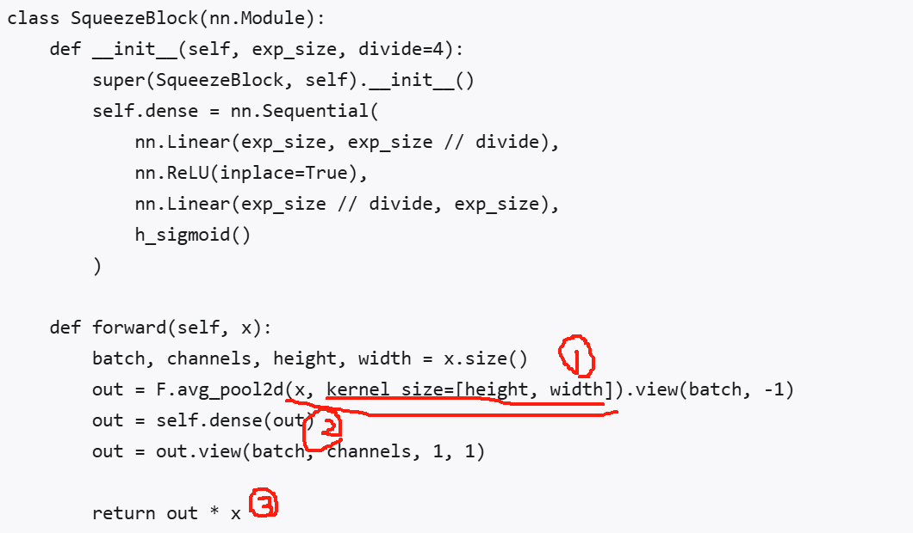
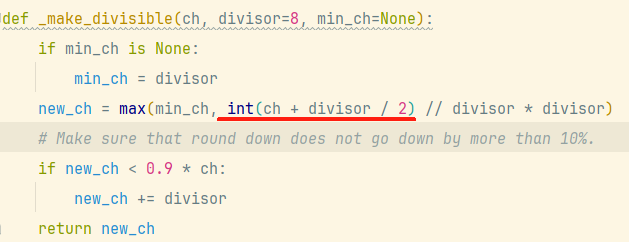

所学习的是mobilenet系列网络

此网络适合于移动设计，显著减少了参数与运算量，使得实时分割运行效果更好

v3中使用了倒残差结构，与都是含有两层1x1卷积核进行维度改变，但ResNet是先降后升，MobileNet v2中的是先升再降，减少了参数的计算

使用了新的减少量化的函数h-sigmoid,与h-swich，且h-sigmoid,可以使得低维特征信息更得以保存相较于relu

shortcut分支也就是将input直接与输出相加，也就是实线，如果不能直接相加则使用1x1卷积核进行维度转换

改变了残差块，其中引入了se，其使用了注意力机制，即重要的权重赋更大的值，se层算出来的值是每一通道的参数，其值应当与对应层进行相乘，调整的是通道之间的重要率

# MobileNet

这个卷积模块特别适合于移动设计，因为它允许在推理过程中显著减少所需的内存占用，而**无需完全实现大的中间张量**。这减少了许多嵌入式硬件设计中对主存储器访问的需求，这些设计提供了少量非常快速的软件控制缓存

## V1

**创新点：**使用了dw卷积

​	dw卷积与原卷积不同之处在于，现在不再是由每个卷积核的每个通道与对应的输出通道进行计算，而是每个卷积核对应一个通道，这样就会造成输出与输入的通道数是相同的，且这样能用更少的参数生成更多的输出深度

仔细观察上图可以发现，普通卷积进行计算是使用不同深度上进行对应计算再相加成为一个通道，而DW就用卷积核取代了通道，而一个卷积核一定输出一个通道，所以会生成输入通道数，同时由于没有深度参数也更少了

dw相相比于普通卷积核弱化了特征，使其特征突出感没那么强

按发展规律其实应当pw层先出现，后出现dw层


**这里介绍新的卷积词即pw卷积与dw卷积**

​	相比于dw卷积，pw卷积其实就是普通卷积，只不过规定此时pw卷积中的卷积核大小都是1x1当然此时输入通道数与输出通道数可能不同

**DW+PW共同使用**

由于使用后的DW后的卷积只能输出和输入一样的通道数，所以这里再使用了pw使其进行升维。也是对特征的一种再次提取

这种方式会比传统神经网路速度快很多，因为其参数会减少许多

**网络主干搭建**

如同VGG一样是线性的网络层数搭建

## V2

使用了新的relu函数

**使用倒残差结构**

原本的残差结构是两头粗中间细的结构，倒残差是两头细中间粗的结构

#### ResNet中的残差模块

1. 先使用1×1卷积对特征图的channel进行压缩（减少运算量）
2. 通过3×3卷积提取特征
3. 使用1×1卷积扩充channel

####  MobileNet v2中的逆残差模块

1. 先使用1×1卷积对特征图的channel进行升维
2. 通过卷积核大小为3×3的DWConv进行特征提取
3. 通过1×1卷积对特征图进行降维处理
4. 使用的激活函数为ReLU6激活函数

都是含有两层1x1卷积核进行维度改变，**但ResNet是先降后升，MobileNet v2中的是先升再降**


**倒残差结构最后输出函数改变：**

- ReLU激活函数对低维特征信息造成大量损失
- 而对高维特征信息造成的损失很小。

但是由于倒残差结构最后一层是进行降维，所以在这里再使用relu会使信息丢失，所以使用线性激活函数


当`stride=1`且输入特征矩阵与输出特征矩阵的shape相同时才有shortcut分支（shape不同，shortcut分支如果没有其他部件，那么shortcut会报错😂

shortcut分支也就是将input直接与输出相加，也就是实线，如果不能直接相加则使用1x1卷积核进行维度转换


每一行描述一个或多个相同(步长)层的序列，重复 n 次。同一序列中的所有层具有相同数量的输出通道 c 。每个序列的第一层有一个步幅 s ，其他所有使用步幅1 。所有的空间卷积都使用3 × 3核。如表1所示，扩展因子 t  总是应用于输入大小。

其中t代表1x1卷积核要将输入通道提升多少倍

​	c代表block经过完整的流程后最终输出卷积核深度

​	n代表当前block进行的次数，由于第一层是1x1卷积核所以可以很简单的进行深度转换

​	s代表当前block第一层1x1卷积核的步长，也就是会进行长宽的变换，在block层中的其他层都默认步长为1

​	k为类别数

当t为1时将不使用反残差块，因为升维与降维都是由1x1卷积核完成的，此时将不使用1x1那么可以直接使用bw层

ps:步长（Stride）和步幅是同义词


### **代码理解**

由于BW卷积操作也是由Conv2d实现，所以其中的参数groups用于改变卷积类型，当groups等于输入通道数时为BW


**_make_divisible** 函数的作用是进行检查当前传播的卷积层的深度是否是8的倍数

​	这是一种设计结构可以优化模型计算


**ConvBNReLU 类**属于是实现了cba层也就是一Bneck

- 一个Block由一系列Bneck组成


**InvertedResidual 类**则是实现了一个完整的block，需要注意的是与残差相反的这里是可以直接进行快捷相加（输入通道和输出通道相同，并且步幅为1）


**MobileNetV2 类**：其中包含了多个残差块形成模型

​		第一层为2其余层为1，为1能省略第一个1x1卷积核

## V3

改变了残差块，其中引入了se，其使用了注意力机制，即重要的权重赋更大的值，se层算出来的值是每一通道的参数，其值应当与对应层进行相乘

调整的是通道之间的重要率，SE模块的主要目标是让网络自动学习并调整特征图中各个通道之间的权重关系，以便更好地关注重要的特征。

存在于残差块中


模型可分为三个大体

- 起始部分：1个卷积层，通过3x3的卷积，提取特征；
- 中间部分：多个卷积层，不同Large和Small版本，层数和参数不同；
- 最后部分：通过两个1x1的卷积层，代替全连接，输出类别；


**起始部分**，在Large和Small中均相同，也就是结构列表中的第1个卷积层，其中包括3个部分，即卷积层、BN层、h-switch激活层。

h-sigmoid是非线性激活函数，用于SE结构，除此之外使用h-switch函数


**中间部分**是多个含有卷积层的块（MobileBlock）的网络结构，参考，Large的网络结构

NL：Non-Linearity，非线性；

HS：h-swish激活函数，RE：ReLU激活函数；

exp size：expansion factor，膨胀参数；（beneck中的升维，但最后会进行降维为out）

每一行都是一个MobileBlock，即bneck。


**MobileBlock**

三个必要步骤：

1. 1x1卷积，由输入通道，转换为膨胀通道；
2. 3x3或5x5卷积，膨胀通道，使用步长stride；
3. 1x1卷积，由膨胀通道，转换为输出通道。

两个可选步骤：

1. SE结构：Squeeze-and-Excite；
2. 连接操作，Residual残差；步长为1，同时输入和输出通道相同；




**可选操作1：SE结构**

1. 池化；
2. Squeeze线性连接（Squeeze用于制造线性执行操作） + RELU + Excite线性连接 + **h-sigmoid**；
3. resize；
4. 权重与原值相乘；

定义了一个全连接层的序列，首先将输入通道数压缩到 `exp_size // divide`，然后通过 ReLU 激活函数，再将其恢复到 `exp_size`，最后通过 `h_sigmoid` 激活函数进行输出。

注意：这里第一步则是对其使用最大池化，这时其每个通道只有一个块，通道数不变，之后会用到两个1x1卷积核先对其降维（使用relu），再对其升维(h_sigmoid,减小量化,注：h_swich是防止参数减少产生更大误差)



```text
out = F.avg_pool2d(x, kernel_size=[height, width]).view(batch, -1)
```

- **全局最大池化**：如果使用的池化窗口大小与输入的高和宽相同（即 `kernel_size=[height, width]`），则每个通道的所有像素值会被取最大值，得到一个单一的值。
- **输出形状**：经过全局平均池化后，输出的形状变为 `(batch_size, channels, 1, 1)`，即每个通道只剩下一个平均值。


 **最后部分**

最后部分（Last Stage），通过将Avg Pooling提前，减少计算量，将**Squeeze操作省略**，直接使用1x1的卷积，如图：


### 代码



理解：

四舍五入的基本原则是：当一个数到达某个基准值的一半时，应该向上舍入；而低于一半时，则向下舍入。为了实现这一点，需要将原始值 `ch` 加上 `divisor` 的一半。**这里相当于去掉divisor的一半以判断原始值 `ch`是否达到`divisor` 的一半若达到则向上取值**
